# Creating a 3D Model
[Learning Together](https://www.blender.org/) How to create 3d models in Blender.
Give you more control over the final 3D model.

## Quick Blender Overview

For this guide I'm using Blender, which is excellent and free 3D modeling software.
If you're already handy with Blender this section might be all you need. Otherwise, see the next section for screenshots and more detail.

**Version**: Constructing the model requires boolean operations on objects with co-planar surfaces. The only way I got this to properly work in Blender was using version **2.79b** which still has the `Carve` solver for the boolean modifier. I couldn't get it to work on 2.8+. According to the Blender forums, proper boolean operations with coplanar surfaces is in development, so this may change.

- Import `sea` and `domain` and extrude them both in the z axis. Subtract `sea` from `domain` using boolean difference. Make sure to use `Carve` as the solver.
- Import `coastline` and extrude in the z axis. Union with `domain`.
- Import `river` and extrude in z axis. Subtract from `domain` with boolean difference.
- If you don't care about accurate roads, import `blocks` and `buildings` and place them on top of `domain`.
- If you want proper road geometry, import `roads`. Extract in z, select all, press `p -> By loose parts`. This splits each road into its own object.
- Enable `Bool Tools` addon
- Select `domain` and all of the separate road objects, with `domain` as the active object.
- Use `BoolTools -> difference` to subtract roads from `domain`.
- If the resulting mesh is fine, move on. Otherwise, select one of the top faces, press `shift+G -> normal` or `shift+G -> coplanar` to select all the top faces. Move these to a separate object with `p -> selection`. Delete the old object, extrude the new object.
- Import roads again, extrude in z, use it to create the roads by filling the gaps in `domain`. Control the road depth with the z location of `roads`.
- Import `domain` again, use it to create the sea and river. Control the depth with its z value.

## Detailed Blender Overview

Note that this isn't intended to be a first-time Blender tutorial, and may assume basic Blender knowledge.

### Create Land

Import `domain.stl`, which represents the area of the city including land and sea. Import `sea.stl`. Don't move any of these in the `x` or `y` axes after import to make sure that they stay in the same place relative to each other.
Extrude both in the `z` axis, as shown below.

We're going to be using the `Boolean` modifier a lot here, which adds and subtracts meshes from each other. Hide the sea object (`h`) and in object mode, select `domain`. Go to the 'Modifiers' tab and add a boolean modifier.
In this order select `Difference`, `Carve`, then set the object to `Sea`. 

| Extruded Sea and Domain | Domain-Sea Boolean Settings |
| :----------: | :----------: |
| 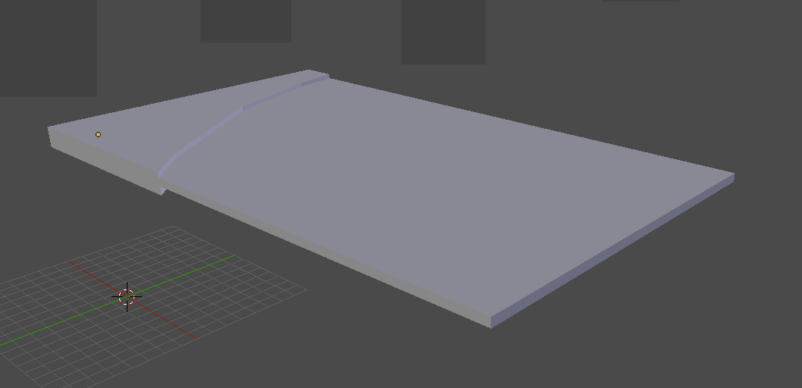 | 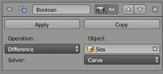 |

Click `Apply`. You should see that the sea has been subtracted from the domain. You can now delete the `sea` object.

| Land |
| :----------: |
| 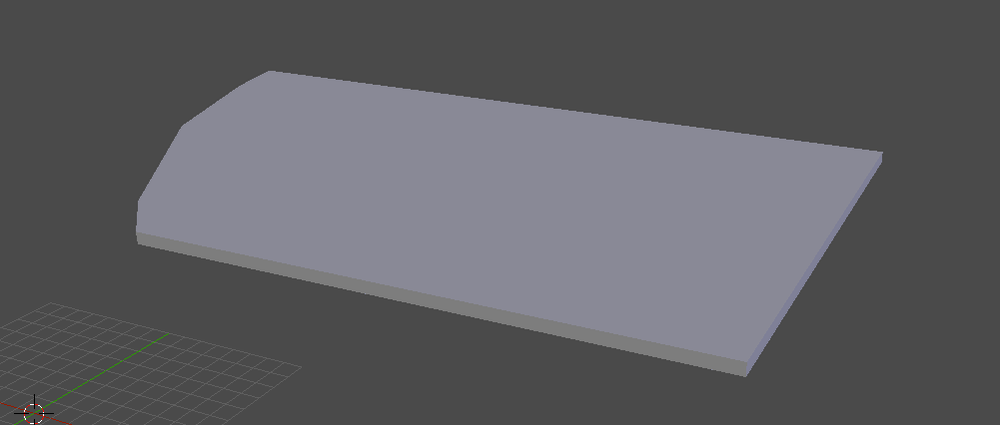 |

Import `coastline`. The JS libraries used to build the mesh may not always triangulate in the best way. An optional step here is to select all of the `coastline` in edit mode, and press `x -> Dissolve Faces`.
Extrude it downwards along the z axis. If some of the faces look strangely dark, in edit mode, select all with `A` and press `Ctrl+n` to correct normals.

Hide the coastline (`h`), and select the `domain` in object mode. Add another `Boolean` modifier. Use the same settings as last time except choose `Union` and set the target object as `coastline`. This will join the coastline to the land.
Press `Apply`. You can now delete the `coastline` object.

| Combine faces into one | Extrude coastline |
| :----------: | :----------: |
| 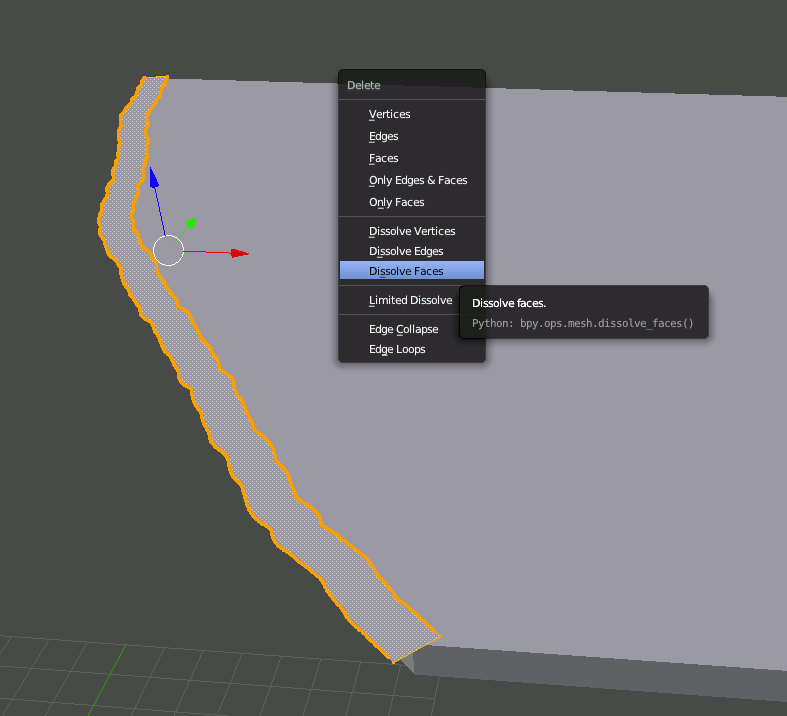 | 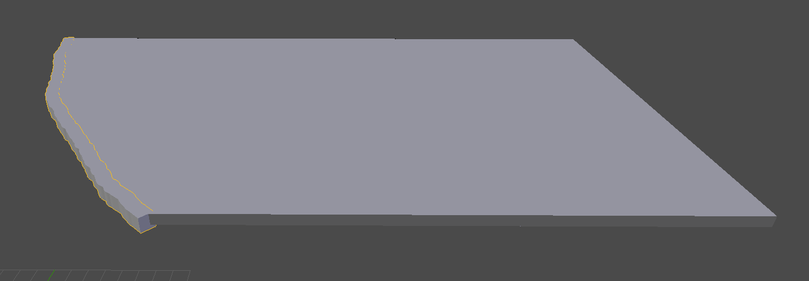 |

Use similar steps to subtract `river.stl` from the `domain`. Make sure to 'Apply' the modifiers. You can delete the river object now.

| Import and extrude river | River boolean settings | Subtracted river |
| :----------: | :----------: | :----------: |
|  | 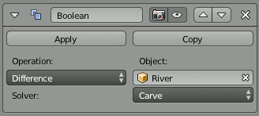 |  |

### Easy, less accurate roads

Properly creating the roads requires subtracting them all from this mesh. If you don't want or need accurate roads, you can just import and place `blocks.stl` and `buildings.stl` to create the city.
Roads will be 'created' in the spaces between the `blocks`. Note that this method does not create the paths through parks.
Skip ahead to the 'Add Sea' section.

| Import and place blocks | Import and place buildings | No paths through park |
| :----------: | :----------: | :----------: |
|  | 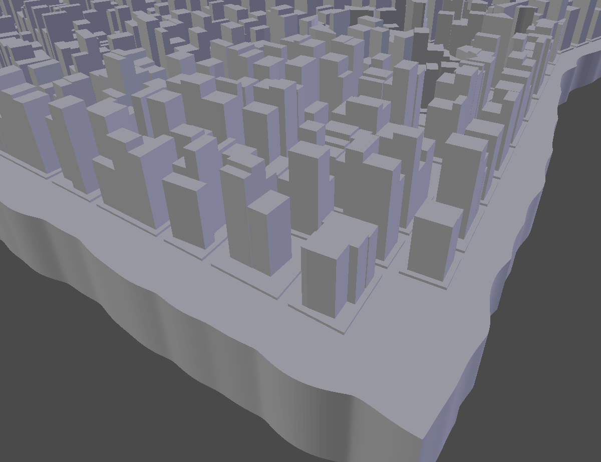 |  |

### Harder, more accurate roads

The issue with the roads is that each one is its own separate geometry - there are no vertices at intersections.
The boolean modifier does not like this because of all the coplanar faces, but we have ways of dealing with it.

Make sure `domain` is the only visible object in the scene (including any lights, cameras, etc).
Import `roads.stl` and optionally: Edit mode, select all, `x -> dissolve faces`. Extrude along the z axis.
Select all, press `p -> By loose parts`. This will separate each individual road into its own object.

| Import roads | Extrude | Separate |
| :----------: | :----------: | :----------: |
| 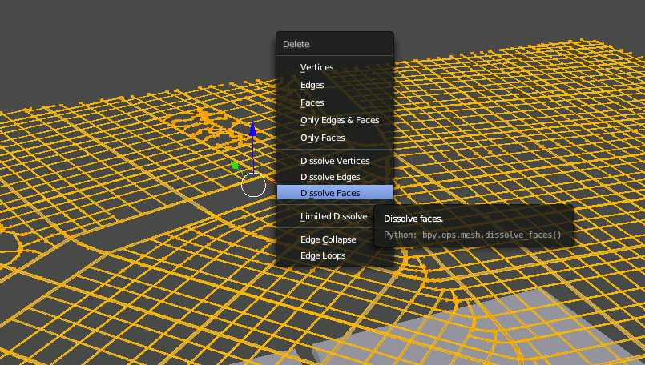 | 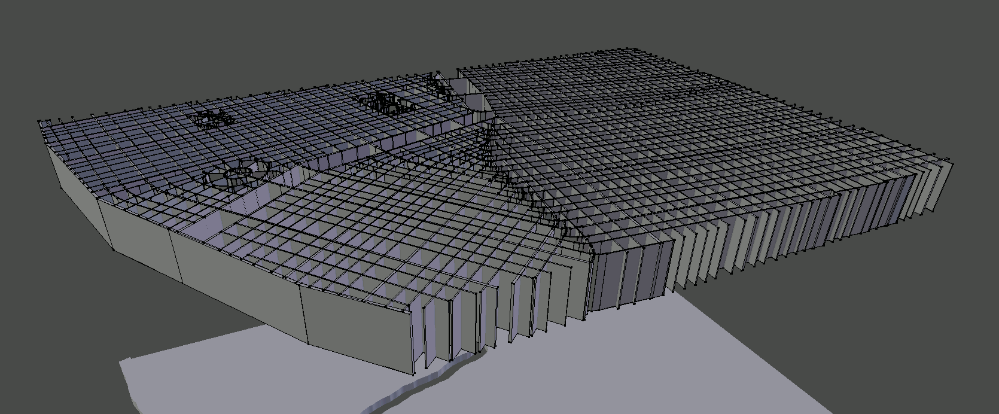 | 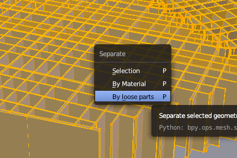 |

We're going to apply the boolean difference modifier between the domain object and each road in turn, but doing this manually would be madness.
Go to `User Preferences -> Addons` and enable the `Bool Tools` addon. This already comes (disabled) with Blender.
Translate the roads in the `z` axis until they are intersected by `domain`.

Select everything (all roads + domain) making sure `domain` is the active object (highlighted in orange). You can do this by selecting `domain`, then pressing `a` twice to unselect, then select all.
Go to `Bool tools` in the tool bar on the left and click `Difference`.

| Translate in Z | Select all, Domain active object | Difference |
| :----------: | :----------: | :----------: |
| 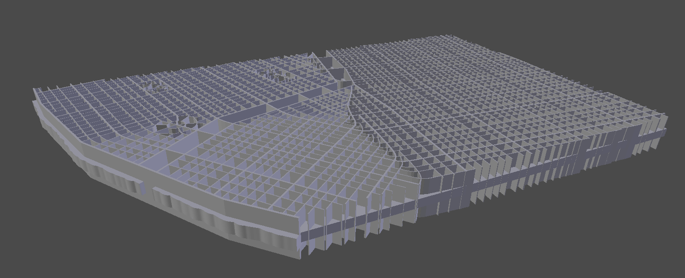 | 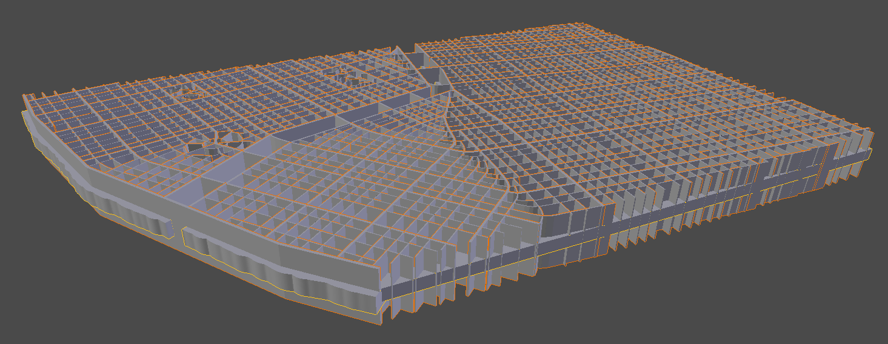 | 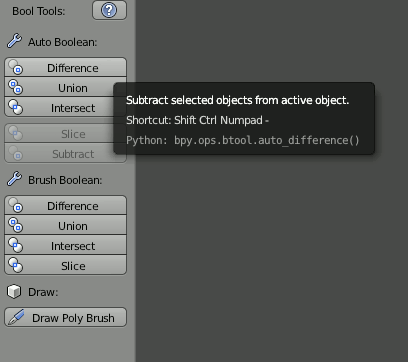 |

| Resulting Domain |
| :----------: |
| 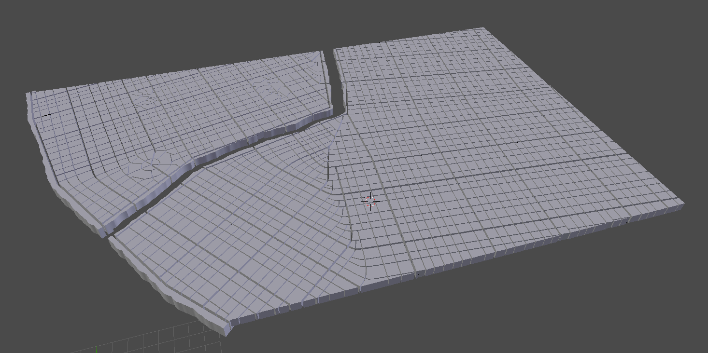 |

This may have produced a clean mesh, but it doesn't always. Here's what to do if your mesh is missing faces like the one below.

- In edit mode, select any top face of the mesh
- Select all top faces using `Shift+G -> Normal` or `Shift+G -> Coplanar`
- Move these faces to a new object using `p -> selection` (you could also invert selection and delete)
- Delete the old object
- Extrude the new object in `z`

| Mesh missing faces | Select top face | Select all top faces |
| :----------: | :----------: | :----------: |
| 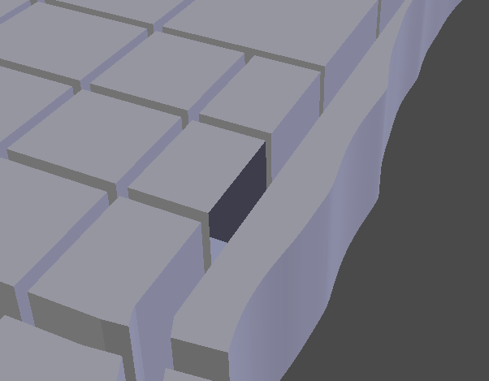 |  |  |

| Select all top faces | To new object | Resulting object |
| :----------: | :----------: | :----------: |
| 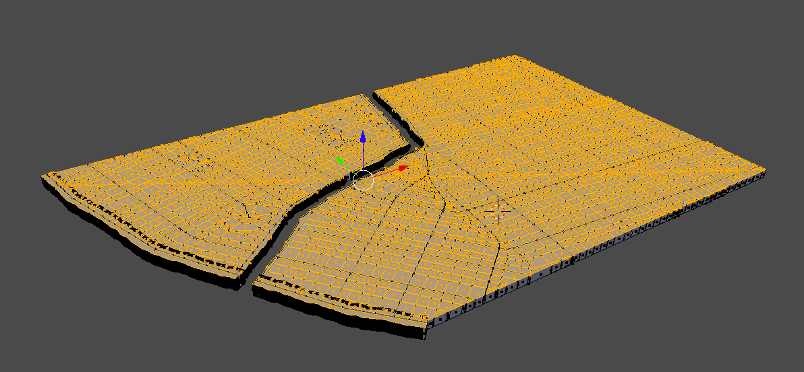 | 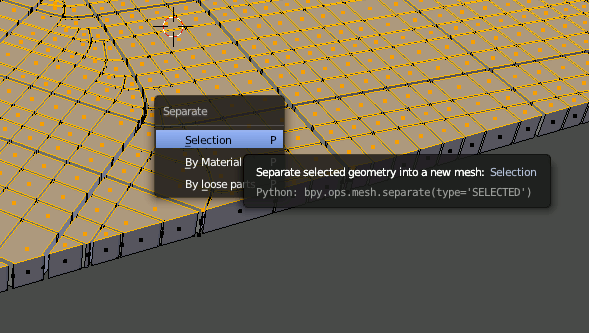 | 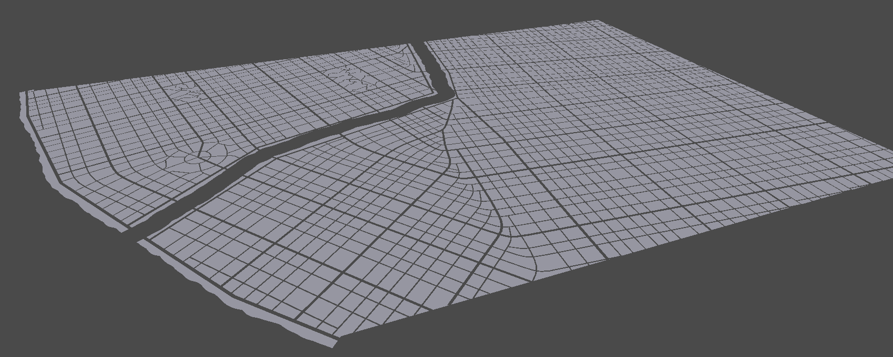 |

Import `roads.stl` again and extrude in `z`. Place inside `domain` to create the roads. Use the `z` value to control the depth of the roads.
Import `buildings.stl` and place them at the correct `z` value.

| Extrude roads | Control road depth | Add buildings |
| :----------: | :----------: | :----------: |
| 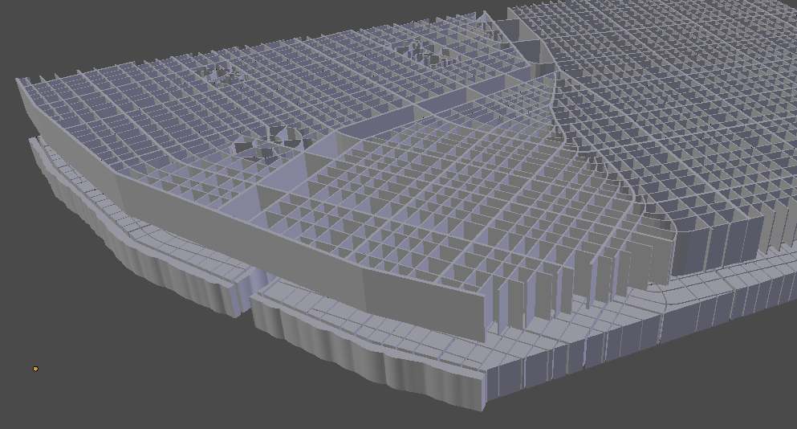 |  | 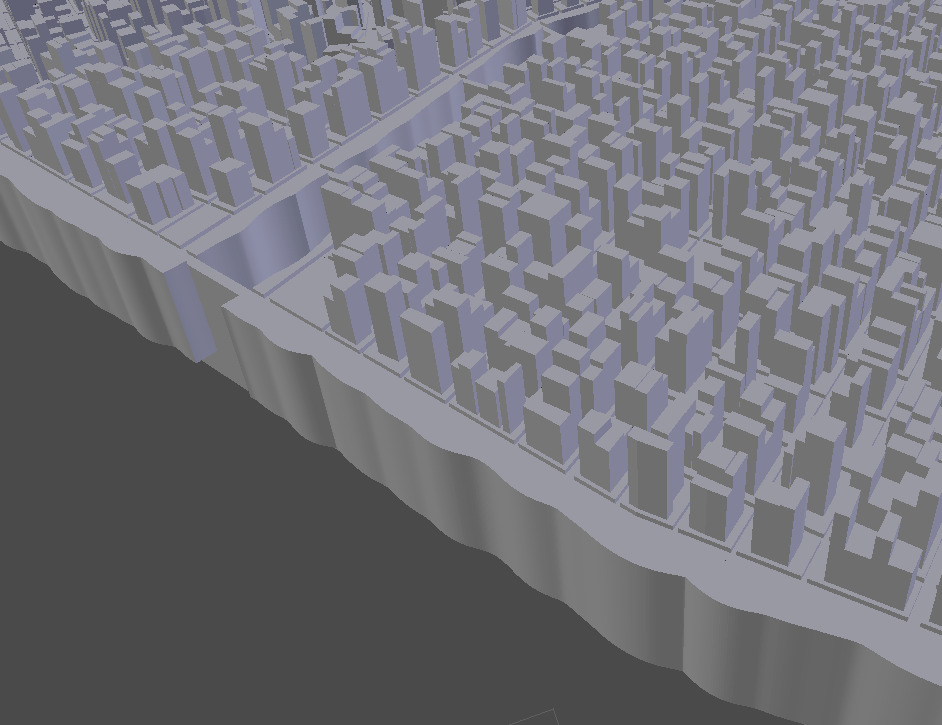 |

### Add Sea

Import `domain.stl` again and control sea/river depth with its `z` value.
Add materials to the different objects. You can select the faces that make up the grass in the parks and assign them to a new object to give them their own material, or assign them their own material there.

| Add sea and river | Select grass | Add materials |
| :----------: | :----------: | :----------: |
| 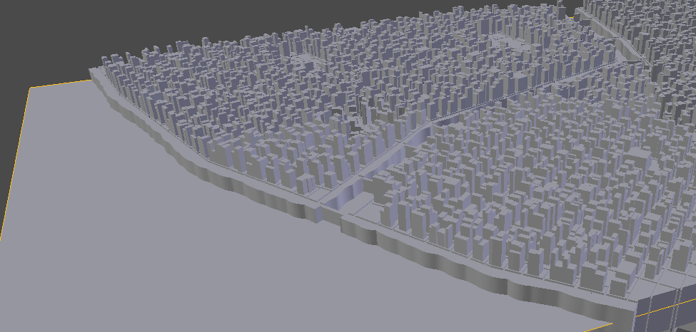 | 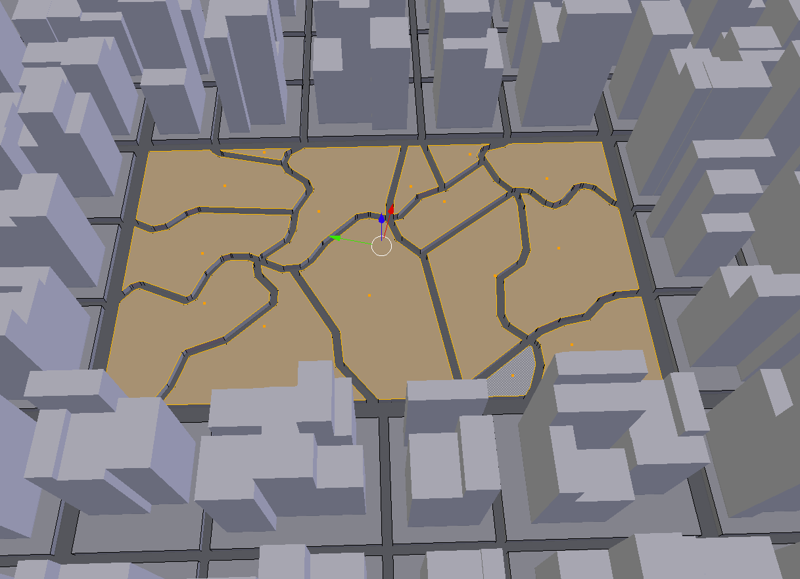 | 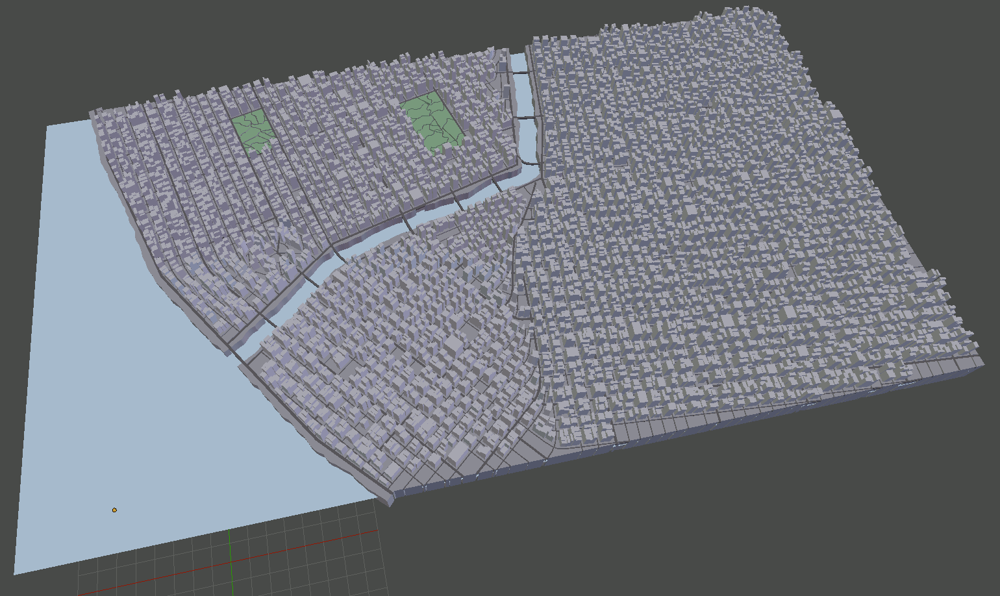 |

## Extra Details

- Select all buildings, then `Select menu -> Random`. In the properties check `deselect` and give it a probability of around 50%. `Ctrl+L` to select all building geometry from those faces and `p -> selected` to assign these to a new object. Do this a few times and you'll have a few different objects, all with random buildings. You can add more variation to building height by controlling these individually. Scaling roof faces along z will affect height variance, translating roof faces will affect average height.
- Select all building rooves and inset, extrude downwards to give them some depth. Check 'Offset Relative' in the inset properties to make it even across all buildings
- Shallow depth-of-field gives a convincing miniature effect
- Watch [Ian Hubert's 'Lazy Tutorial' on making cities](https://www.youtube.com/watch?v=JjnyapZ_P-g)

