[](https://github.com/universalbit-dev/CityGenerator/actions/workflows/github-code-scanning/codeql)
[](https://www.gnu.org/licenses/lgpl-3.0)
[](https://nodejs.org)
[](https://www.lfdecentralizedtrust.org/)
[](https://www.freecodecamp.org/)

**[Web3](https://github.com/freeCodeCamp/web3-curriculum?tab=readme-ov-file)**

---

### [CityGenerator](https://github.com/universalbit-dev/CityGenerator)


**Description**:  
The **CityGenerator** project focuses on creating dynamic city models inspired by the principles outlined in the [Fab City: The Mass Distribution of (Almost) Everything](https://fablabbcn.org/wp-content/uploads/2020/09/Fab-City-The-Mass-Distribution-of-Almost-Everything.pdf) white paper. It aims to provide tools for simulating and visualizing sustainable, self-sufficient, and resilient urban environments.

---

**Key Objectives**:
1. **Sustainability**: Promote local production and reduce dependency on external resources, aligning with the Fab City framework.
2. **Resilience**: Envision cities capable of adapting to environmental, social, and economic changes.
3. **Collaboration**: Create open-source tools and models to engage developers, urban planners, and researchers in building decentralized urban systems.

---

### Clone the project
```bash
git clone https://github.com/universalbit-dev/CityGenerator.git
cd CityGenerator
```
 Node.js 22 LTS supported
### Install packages with npm then generate your city model
```bash
npm i && npm audit fix
npm start
```

---

### 🧠 City Simulation Engine

> This project features a smart city simulation powered by artificial intelligence and neural networks.
>
> - 🌱 **Dynamic Growth**: An AI agent learns to manage and expand your city—making decisions like building infrastructure or balancing resources.
> - ⏯️ **Interactive Controls**: Pause and resume the simulation at any time.
> - 🎓 **Continuous Learning**: The AI improves its strategies automatically as the simulation runs.
>
> _For details, see the simulation logic in [`src/js/index.js`](src/js/index.js)._

---


```mermaid
flowchart TD
    %% UI subgraph
    subgraph UI["User Interface"]
      UIControls["UI Controls (Pause/Resume, Manager Switch)"]
      ManagerInfo["Manager Info Display"]
      StateChart["State Chart (Chart.js)"]
      ActionLog["Action/Reward Log"]
      RewardLog["Reward Log"]
    end

    %% Managers subgraph
    subgraph Managers["City Managers (Modular)"]
      UrbanFabric["UrbanFabricManager"]
      CivicEco["CivicEcosystemManager"]
      Circular["CircularCityManager"]
      SmartCity["SmartCityStateManager"]
      Resilient["ResilientCityModelManager"]
      Commons["CommunityCommonsManager"]
      Permaculture["PermacultureDesignManager"]
      Cookieless["CookielessCityAgent"]
    end

    %% Engine subgraph
    subgraph Engine["Simulation Engine"]
      Init["Initialize City & Agent"]
      DeepQ["DeepQ Neural Agent (deepqlearn.js, convnet.js)"]
      SimStep["Simulate Step (Random/Agent Action)"]
      Update["Manager.update(action)"]
      Stagnation["Stagnation Detection"]
      AutoSwitch["Auto-Manager Switch"]
      RemoveCookies["Remove All Cookies"]
    end

    %% State subgraph
    subgraph State["Simulation State"]
      CityManager["Current CityManager"]
      IsPaused["isPaused"]
      ActionHistory["actionHistory"]
      RewardHistory["rewardHistory"]
    end

    %% UI triggers
    UIControls -- "User selects or triggers" --> Init
    UIControls -- "Switch Manager" --> CityManager
    UIControls -- "Pause/Resume" --> IsPaused

    %% Engine logic
    Init --> DeepQ
    Init --> CityManager
    CityManager --> UrbanFabric
    CityManager --> CivicEco
    CityManager --> Circular
    CityManager --> SmartCity
    CityManager --> Resilient
    CityManager --> Commons
    CityManager --> Permaculture
    CityManager --> Cookieless
    SimStep --> Update
    Update --> StateChart
    Update --> ActionLog
    Update --> RewardLog
    SimStep --> Stagnation
    Stagnation --> AutoSwitch
    AutoSwitch --> CityManager
    RemoveCookies --> UIControls

    %% State updates
    Update --> ActionHistory
    Update --> RewardHistory

    %% UI updates
    StateChart --> State
    ManagerInfo --> State
    ActionLog --> State
    RewardLog --> State

    %% Dependencies (dotted arrows)
    DeepQ -.-> convnet["convnet.js"]
    DeepQ -.-> deepqlearn["deepqlearn.js"]
    StateChart -.-> chartjs["chart.js"]
    UIControls -.-> bootstrap["bootstrap, CSS"]
    UIControls -.-> vis["vis.js"]
```

**HTTPS Automated Certificate Generation**:
   - To simplify the process for users, the project is set up to automatically generate the SSL/TLS certificate and private key required for HTTPS during the npm install process. This eliminates the need for manual certificate creation, streamlining the setup of the HTTPS server.

**Fixing Issues**:
   - If you encounter any issues with the HTTPS server or certificate generation, refer to the [SSL README](ssl/readme.md) for detailed instructions and troubleshooting tips.

**Resources**
- [Docs](https://github.com/universalbit-dev/CityGenerator/tree/master/docs)
- [CityGenerator usage](https://github.com/universalbit-dev/CityGenerator/blob/master/docs/usageguide.md)
---

</img> </img> </img> </img> </img> </img> 

| City Generator                        | [Images](https://github.com/universalbit-dev/CityGenerator/tree/master/docs/assets/images)                             |
| ----------------------------------- | ----------------------------------- |
|  |  |

|                             |                             |
| ----------------------------------- | ----------------------------------- |
|   |   |
|   |   |

> **Note:** Images marked with `ai_map_*` were generated using **Google Gemini AI**.

##### About Author of City Map Generator: [@probabletrain](https://github.com/ProbableTrain/MapGenerator)
* [WebSite](https://maps.probabletrain.com/#/)
* [Support City Map Generator](https://ko-fi.com/probabletrain)
  
##### Thanks!
---


* [Compiler WebPack5 release](https://webpack.js.org/blog/2020-10-10-webpack-5-release/)
* [TypeScript Note](https://webpack.js.org/guides/typescript/)

#### Build your Project:
* [Community Help Request](https://github.com/universalbit-dev/CityGenerator/blob/master/docs/community_help_request.md)
---
"In a project like CityGenerator, which seems to involve complex features (e.g., blockchain-driven urban designs), managing bundle size is critical for ensuring good performance, especially for web-based applications. Using webpack-bundle-analyzer can help identify and reduce inefficiencies in the build output"

```bash
npm run build
```
---

##### Blockchain Integration: Information about integrating with DigiByte and other blockchain environments.
-- [DigiByte Integration Guide](https://www.digibyte.org/docs/integrationguide.pdf) --
-- [Documentation and examples](https://github.com/RenzoDD/digibyte-js?tab=readme-ov-file#documentation--examples-) --
#### Blockchain Environment
-- [Workers](https://github.com/universalbit-dev/CityGenerator/blob/master/workers/readme.md)

##### Contributing: feel free to make something of amazing.
## 📢 Support the UniversalBit Project
Help us grow and continue innovating!  
- [Support the UniversalBit Project](https://github.com/universalbit-dev/universalbit-dev/tree/main/support)  
- [Learn about Disambiguation](https://en.wikipedia.org/wiki/Wikipedia:Disambiguation)  
- [Bash Reference Manual](https://www.gnu.org/software/bash/manual/)

---
  
## License
Distributed under the LGPL-3.0 License. See [lgpl-3.0.txt](https://www.gnu.org/licenses/lgpl-3.0.txt)

